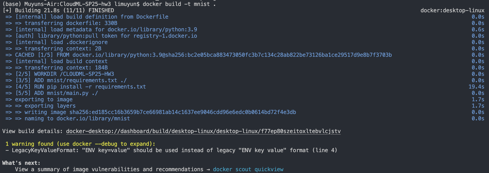
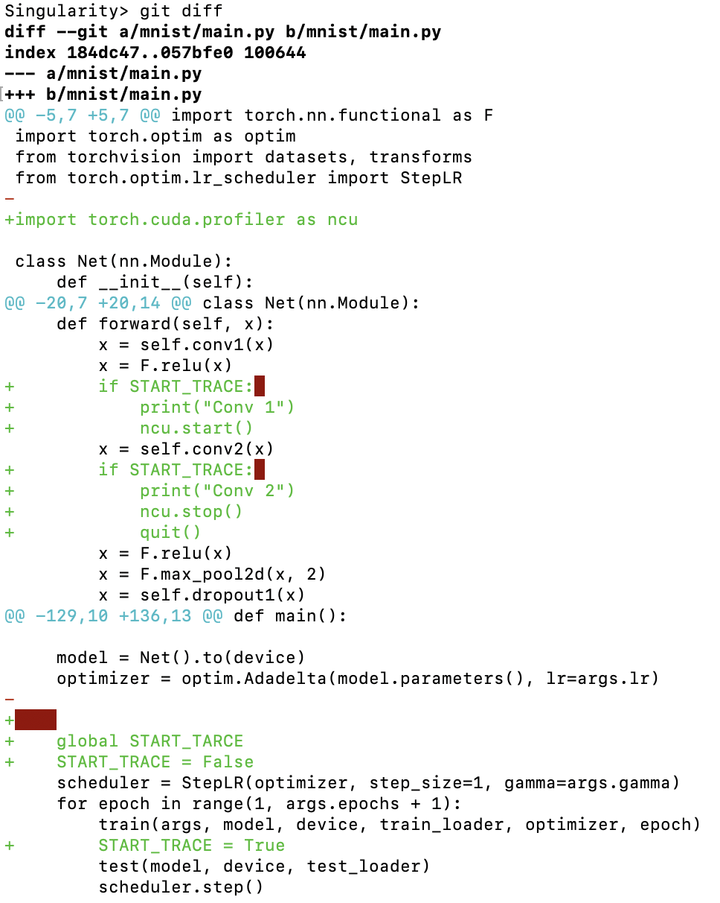
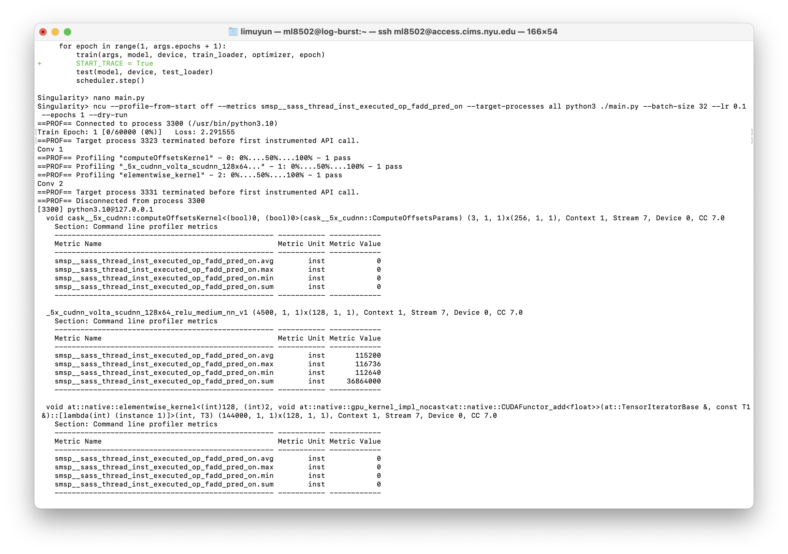

# CloudML-SP25-hw3

## Usage
```
$ git clone https://github.com/muyunli123/CloudML-SP25-hw3.git
$ cd CloudML-SP25-hw3
$ docker build -t mnist .
$ docker run -it mnist python main.py --epochs 1 --batch-size 32 --lr 0.1 --dry-run --no-cuda 2>&1 | tee docker-run.out
```

## Workflow
### Step 1: Setting Up the Docker Environment
- (Since Docker can be run on Mac without building virtual machine, we delete the files related to Vagrant)
- Create a Dockerfile specifying the base image and working directory
- Install necessary dependencies via `pip` from a `requirements.txt` file
- Copy application code to the Docker container and define a `CMD` to run the application

    #### Dockerfile Configuration: 
    - Changed base image from ```alpine:3.17``` to ```python:3.9```
    - Deleted the following part since we did not use the Alpine base image : 
        ```
        # Install just the Python runtime (no dev)
        RUN apk add --no-cache \
            python \
            py-pip \
            ca-certificates
        ```
    - Changed ```/hello-app``` to ```/mnist``` and ```hello.py``` to ```main.py```

### Step 2: Building the Docker Image
- Command: `docker build -t mnist .`
- The image was successfully built with 20 layers and a total size of approximately 1.77 GB


### Step 3: Running the MNIST model
- Command to run: `docker run -it mnist python main.py --epochs 1 --batch-size 32 --lr 0.1 --no-cuda 2>&1 | tee docker-run.out`
- Flags Explanation:
  - `--epochs 1`: Sets training to 1 epoch for a quick test
  - `--batch-size 32`: Smaller batch size for faster execution
  - `--lr 0.1`: Reduced learning rate for quick testing
  - `--no-cuda`: Disables CUDA as it’s unavailable
  - `2>&1 | tee docker-run.out`: Captures all output in `docker-run.out`

### Step 4: Inspecting Image Layers
- The image was built with 20 layers, including:
  - Base image installation and environment variables
  - Dependency installation (`pip install -r requirements.txt`), which is the largest layer (~767.59 MB)
  - Adding application files (`main.py` and `requirements.txt`)
  - Specifying the command to run the application (`CMD ["python", "main.py"]`)


## Observation and Comparison
- The image size is relatively large (1.77 GB) due to installing dependencies like PyTorch
- Layer inspection shows that the largest layer comes from the dependency installation process, and it also takes the majority of time in building the image (19.4s)
- Using `python:3.9` as the base image ensured compatibility with PyTorch but increased the image size compared to Alpine-based images


## Singularity

### Workflow
```
$ ssh <NetID>@access.cims.nyu.edu
$ ssh <NetID>@greene.hpc.nyu.edu
$ ssh burst
$ srun --account=csci_ga_3033_085-2025sp --partition=n1s8-v100-1 --gres=gpu:v100:1 --time=04:00:00 --pty /bin/bash
$ mkdir /scratch/<NetID>/cloudml-hw3
$ cd /scratch/ml8502/cloudml-hw3
$ singularity exec --nv \
    --overlay overlay-25GB-500K.ext3:rw \
    --overlay /share/apps/images/nsight-compute-2023.2.sqf:ro \
    /share/apps/images/cuda11.7.99-cudnn8.5-devel-ubuntu22.04.2.sif \
    /bin/bash
Singularity> export PATH=/ext3/nsight-compute/2023.2:$PATH
Singularity> pip3 install torch torchvision torchaudio
Singularity> python3 -c "import torch; print(torch.__version__); print(torch.cuda.is_available());"
Singularity> git clone https://github.com/pytorch/examples
Singularity> cd examples/mnist
Singularity> nano main.py
Singularity> ncu --profile-from-start off --metrics smsp__sass_thread_inst_executed_op_fadd_pred_on --target-processes all python3 ./main.py --batch-size 32 --lr 0.1  --epochs 1 --dry-run
```
Modifications on `main.py`: 

Final results: 

```
Singularity> ncu --profile-from-start off --metrics smsp__sass_thread_inst_executed_op_fadd_pred_on --target-processes all python3 ./main.py --batch-size 32 --lr 0.1  --epochs 1 --dry-run
==PROF== Connected to process 3300 (/usr/bin/python3.10)
Train Epoch: 1 [0/60000 (0%)]	Loss: 2.291555
==PROF== Target process 3323 terminated before first instrumented API call.
Conv 1
==PROF== Profiling "computeOffsetsKernel" - 0: 0%....50%....100% - 1 pass
==PROF== Profiling "_5x_cudnn_volta_scudnn_128x64..." - 1: 0%....50%....100% - 1 pass
==PROF== Profiling "elementwise_kernel" - 2: 0%....50%....100% - 1 pass
Conv 2
==PROF== Target process 3331 terminated before first instrumented API call.
==PROF== Disconnected from process 3300
[3300] python3.10@127.0.0.1
  void cask__5x_cudnn::computeOffsetsKernel<(bool)0, (bool)0>(cask__5x_cudnn::ComputeOffsetsParams) (3, 1, 1)x(256, 1, 1), Context 1, Stream 7, Device 0, CC 7.0
    Section: Command line profiler metrics
    --------------------------------------------------- ----------- ------------
    Metric Name                                         Metric Unit Metric Value
    --------------------------------------------------- ----------- ------------
    smsp__sass_thread_inst_executed_op_fadd_pred_on.avg        inst            0
    smsp__sass_thread_inst_executed_op_fadd_pred_on.max        inst            0
    smsp__sass_thread_inst_executed_op_fadd_pred_on.min        inst            0
    smsp__sass_thread_inst_executed_op_fadd_pred_on.sum        inst            0
    --------------------------------------------------- ----------- ------------

  _5x_cudnn_volta_scudnn_128x64_relu_medium_nn_v1 (4500, 1, 1)x(128, 1, 1), Context 1, Stream 7, Device 0, CC 7.0
    Section: Command line profiler metrics
    --------------------------------------------------- ----------- ------------
    Metric Name                                         Metric Unit Metric Value
    --------------------------------------------------- ----------- ------------
    smsp__sass_thread_inst_executed_op_fadd_pred_on.avg        inst       115200
    smsp__sass_thread_inst_executed_op_fadd_pred_on.max        inst       116736
    smsp__sass_thread_inst_executed_op_fadd_pred_on.min        inst       112640
    smsp__sass_thread_inst_executed_op_fadd_pred_on.sum        inst     36864000
    --------------------------------------------------- ----------- ------------

  void at::native::elementwise_kernel<(int)128, (int)2, void at::native::gpu_kernel_impl_nocast<at::native::CUDAFunctor_add<float>>(at::TensorIteratorBase &, const T1 &)::[lambda(int) (instance 1)]>(int, T3) (144000, 1, 1)x(128, 1, 1), Context 1, Stream 7, Device 0, CC 7.0
    Section: Command line profiler metrics
    --------------------------------------------------- ----------- ------------
    Metric Name                                         Metric Unit Metric Value
    --------------------------------------------------- ----------- ------------
    smsp__sass_thread_inst_executed_op_fadd_pred_on.avg        inst            0
    smsp__sass_thread_inst_executed_op_fadd_pred_on.max        inst            0
    smsp__sass_thread_inst_executed_op_fadd_pred_on.min        inst            0
    smsp__sass_thread_inst_executed_op_fadd_pred_on.sum        inst            0
    --------------------------------------------------- ----------- ------------
```

## Mapping to Learnt Concepts
- Containerization: Packaging applications with dependencies into isolated environments.
- Docker vs. Singularity:

  - Docker uses layered images, which can be very large.

  - Singularity uses .sif files, which are usually smaller and easier to distribute in HPC environments.

- Dependency Management: Using pip to install dependencies in both systems.