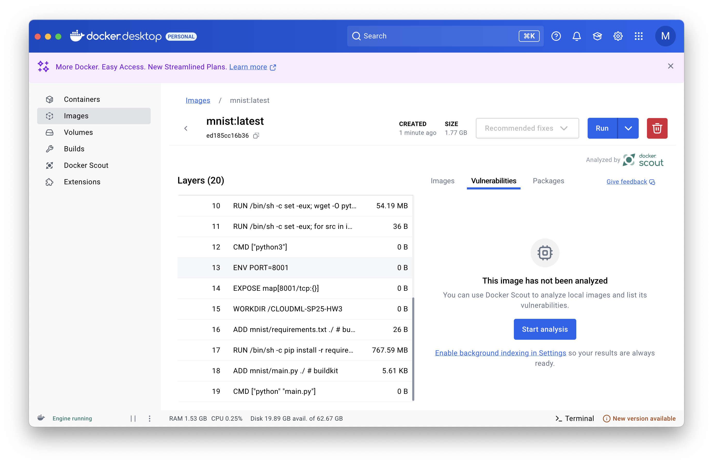

# CloudML-SP25-hw3

## Usage
```
$ git clone https://github.com/muyunli123/CloudML-SP25-hw3.git
$ cd CloudML-SP25-hw3
$ docker build -t mnist .
$ docker run -it mnist python main.py --epochs 1 --batch-size 32 --lr 0.1 --dry-run --no-cuda 2>&1 | tee docker-run.out
```

## Workflow
### Step 1: Setting Up the Docker Environment
- (Since Docker can be run on Mac without building virtual machine, we delete the files related to Vagrant)
- Create a Dockerfile specifying the base image and working directory
- Install necessary dependencies via `pip` from a `requirements.txt` file
- Copy application code to the Docker container and define a `CMD` to run the application

    #### Dockerfile Configuration: 
    - Changed base image from ```alpine:3.17``` to ```python:3.9```
    - Deleted the following part since we did not use the Alpine base image : 
        ```
        # Install just the Python runtime (no dev)
        RUN apk add --no-cache \
            python \
            py-pip \
            ca-certificates
        ```
    - Changed ```/hello-app``` to ```/mnist``` and ```hello.py``` to ```main.py```

### Step 2: Building the Docker Image
- Command: `docker build -t mnist .`
- The image was successfully built with 20 layers and a total size of approximately 1.77 GB


### Step 3: Running the MNIST model
- Command to run: `docker run -it mnist python main.py --epochs 1 --batch-size 32 --lr 0.1 --no-cuda 2>&1 | tee docker-run.out`
- Flags Explanation:
  - `--epochs 1`: Sets training to 1 epoch for a quick test
  - `--batch-size 32`: Smaller batch size for faster execution
  - `--lr 0.1`: Reduced learning rate for quick testing
  - `--no-cuda`: Disables CUDA as it’s unavailable
  - `2>&1 | tee docker-run.out`: Captures all output in `docker-run.out`

### Step 4: Inspecting Image Layers
- The image was built with 20 layers, including:
  - Base image installation and environment variables
  - Dependency installation (`pip install -r requirements.txt`), which is the largest layer (~767.59 MB)
  - Adding application files (`main.py` and `requirements.txt`)
  - Specifying the command to run the application (`CMD ["python", "main.py"]`)




---

## Observation and Comparison
- The image size is relatively large (1.77 GB) due to installing dependencies like PyTorch
- Layer inspection shows that the largest layer comes from the dependency installation process, and it also takes the majority of time in building the image (19.4s)
- Using `python:3.9` as the base image ensured compatibility with PyTorch but increased the image size compared to Alpine-based images


